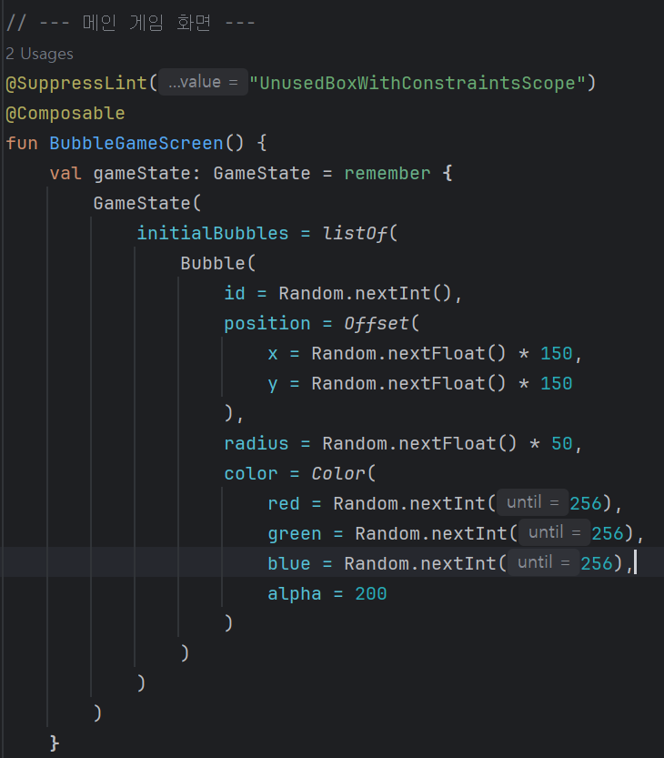

# MobbileApp-practice
- [GitHub 링크](https://github.com/FRONETW/MobbileApp-practice/blob/main/README.md)

---

## 처음 시작

---

## w03: 화면 구성
**배운 내용**
- **Text**: 적성한 문장을 화면에 출력
- **Image**: res 파일의 이미지로 화면에 이미지 출력
- **Column**: 이미지와 문장을 세로로 배치

**화면**

  
  

---

## w04: 프로필 카드 & 메시지 카드

### 프로필 카드
**배운 내용**
- **Row**: 옆으로 나란히 배열 가능
- **Spacer**: 빈 간격(여백)을 사용하여 보기 좋게 구성
- **.size**: 이미지나 박스의 크기 조절
- **padding**: 요소 안쪽 여백
- **margin**: 요소 바깥 여백

  
  
  

### 메시지 카드

  
  
  

### 화이트 모드 / 다크 모드
**미리보기**
- 다크 모드와 일반 모드 차이를 동시에 확인

  
  
  

---

## w05: 이벤트 처리

### 클릭
- Button의 `onClick`으로 클릭할 때마다 값 1씩 증가

  
  
  

### 타이머
- `LaunchedEffect`로 `isRunning`이 `true`일 때마다 `delay`를 주어  
  10ms마다 `timeInMillis`에 값을 추가 → 시간 흐름 구현

  
  
  

---

## w06: 버블 게임

### 게임화면

  

### UI

  
  

### 버블

  
  

### 이벤트

  
  

---

## 스네이크 게임

### 게임화면

  
  

### 코드

#### 변수

  

- 게임에 필요한: 스네이크, 방향, 음식, gameOver 상태, 게임 사이즈 설정

#### 조작

  
  

**게임 로직**
<ol>
  <li>딜레이 동안 조작 버튼 클릭 시 스네이크 방향 변경 → head에 저장</li>
  <li>newHead의 x, y가 gridSize 범위 밖이면 gameOver = true → 게임 종료</li>
  <li>딜레이 동안 이동 거리와 방향 기반으로 newSnake 생성, 이전 snake 삭제</li>
  <li>food를 먹으면 gridSize 범위 내 랜덤 x, y 위치에 새로운 food 생성</li>
</ol>

#### 오브젝트

  

#### 게임 종료

  

- gameOver = true일 때 버튼 클릭 → gameOver = false로 변경 → 게임 재시작

# 10주차 내용 정리

---

## 1. 머티리얼 라이브러리

- 구글의 머티리얼 디자인은 모바일, 데스크톱, 그 외 다양한 장치를 아우르는 **일관된 애플리케이션 디자인 지침** 제공
- **구성 요소 중심 설계**: Card, Button, TextField 등 모든 UI 컴포넌트를 현대적으로 재설계
- 과거: Jetpack Compose  
  현재: Material Design 3 (**MaterialTheme 중심**)
  - **colorScheme**: M3의 동적 색상 시스템 적용 (`dynamicLightColorScheme`)
  - **typography**: 새로운 Typography 구조 (LineHeight, Weight 등)
  - **shapes**: M3의 곡선 및 둥근 모서리 기준

---

## 2. 공통 Scaffold

- **Scaffold**: MD3의 가장 기본적인 화면 구조를 제공하는 컨테이너
  - topBar, bottomBar, floatingActionButton, content 등 **주요 UI 요소를 슬롯 형태로 제공**
  - 개발자가 각 영역에 원하는 Composable을 쉽게 배치 가능
- **BaseScaffold**: Scaffold를 한 번 더 감싸 앱만의 공통 레이아웃 규칙 적용

**추가 내용**
- **modifier**: Compose에서 UI 요소의 외형, 위치, 크기, 동작을 꾸미는 도구  
  예: `modifier: Modifier = Modifier` → 기본값은 아무것도 적용되지 않음. 필요하면 호출 시점에서 스타일/배치 옵션 추가 가능
- **topBar**: `@Composable () -> Unit` → 인자 없이(Unit), 반환 값 없는 Composable 함수 요구
- **bottomBar**: `@Composable () -> Unit = {}` → 기본 구현 비어 있음. 사용자가 넘기지 않으면 UI 표시 없음

---

## 3. 상단 앱 바 (TopAppBar)

- **smallTopAppBar**: 일반 Toolbar (앱 제목, 메뉴 버튼 등)
- **mediumTopAppBar**: 약간 큰 AppBar (보조 텍스트, 두 줄 제목 적합)
- **largeTopAppBar**: Collapsing Toolbar처럼 확장형, 스크롤 시 축소  
  - Collapsing Toolbar: 스크롤에 따라 크기가 줄어드는 상단 바

**TopAppBarScrollBehavior**
- **pinnedScrollBehavior()**: 스크롤해도 AppBar 고정 (Collapsing 없음)
- **enterAlwaysScrollBehavior()**: 스크롤 내릴 때 AppBar 숨김, 위로 올릴 때 다시 등장
- AppBar가 점진적으로 축소 → 특정 높이까지 줄어듦 (레이아웃 반영)

**추가 내용**
- `(()->Unit)?`: 인자 없이 실행되고 반환값 없는 함수
- **onBackClick: (() -> Unit)?**: 뒤로가기 클릭 시 실행 함수, 값 없으면 아무 동작 없음
- **IconButton**: 클릭 가능한 버튼 Composable

---

## 4. Navigation Drawer

- **ModalNavigationDrawer**: 전체 Drawer 동작 관리 (슬라이드, 애니메이션 등)
- **AppDrawer()**: 실제 Drawer UI, 외부에서 `drawerState`와 `onItemSelected()` 추가
- **selectedItem**: 클릭된 아이템 강조 상태를 로컬 state로 관리
- **AppDrawerPreview()**: Drawer를 열린 상태로 미리보기 가능
- **색상 적용**: 테마에서 `onPrimary`를 이용해 AppTopBar와 시각 통일

