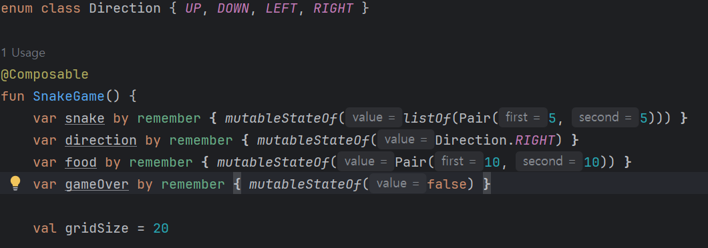
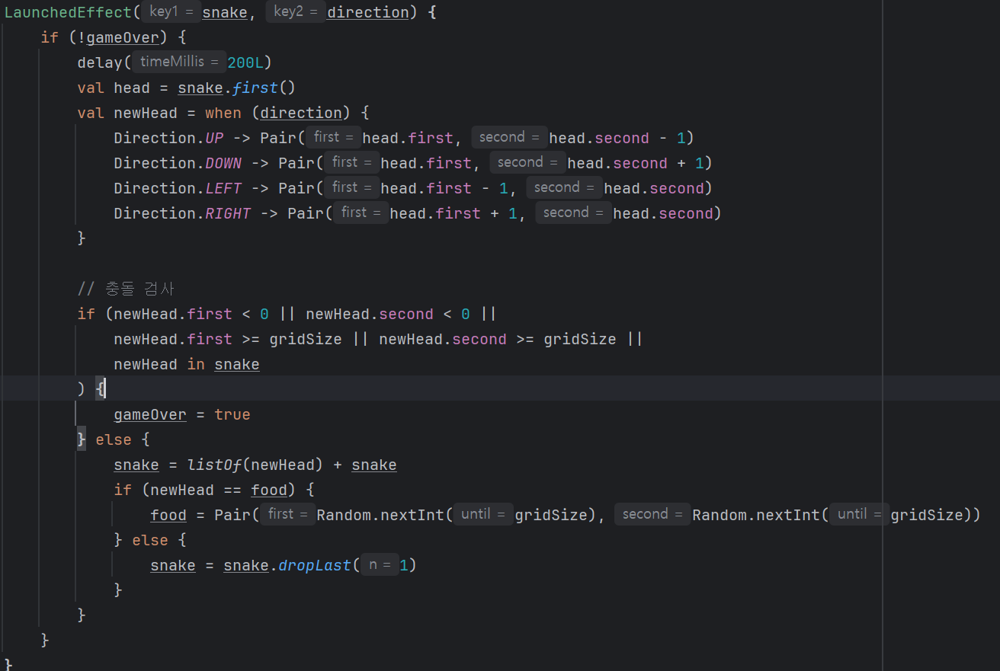
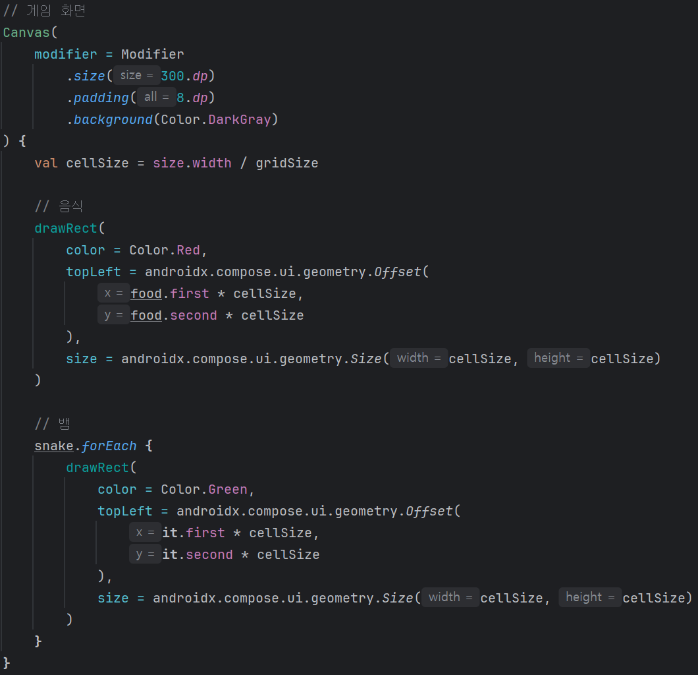
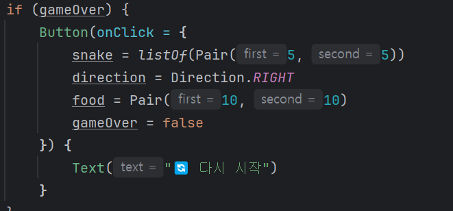

# MobbileApp-practice
-https://github.com/FRONETW/MobbileApp-practice/blob/main/README.md

### 처음 시작 ###

## w03  ( 화면구성 )

  
  

- **배운 내용:**  
  Text: 적성한 문장을 화면에 출력
  Image: res파일의 이미지 파일을 이용해서 화면에 이미지 출력
  Column: 이미지와 문장을 쓰기 위해서 사용

## w04 ( 프로킬 카드, 메시지 카드 )
**프로킬_카드**

  
  
  

- **배운 내용:**  
  Row: 옆으로 나란히  배열 가능하게됨
  Spacer: 빈 간격(여백)을 사용자가 좀더 보기 편하게 만듬
  .size: 이미지나 박스의 크기 조절
  padding: 요소 안 테두리의 여백
  margin: 요소 밖 다른 요소와의 간격

**메시지_카드**

  
  
  

**_화이트 모드, 다크 모드_**

  
  
  

## w05 ( 이벤트 처리 )
**클릭**

  
  
  

**타이머**

  
  
  

## w06 ( 버블 게임 )
## 게임화면

  

## UI ##

  

## 버블 ##

  
  

## 이벤트 ##

  
  

## 스네이크 게임
**게임화면**

  
  

**코드**

## 변수

## 조작

## 오브젝트

## 게임종료

