# MobbileApp-practice
-https://github.com/FRONETW/MobbileApp-practice/blob/main/README.md

### 처음 시작 ###

## w03  ( 화면구성 )

  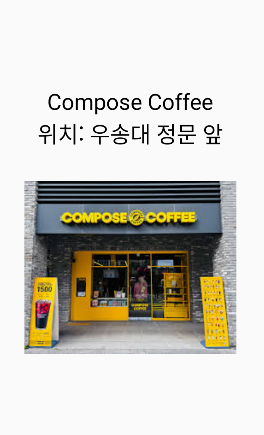
  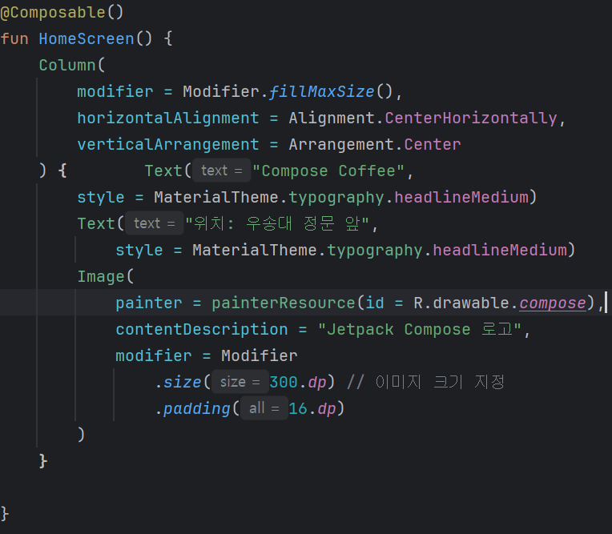

## w04 ( 프로킬 카드, 메시지 카드 )
**프로킬_카드**

  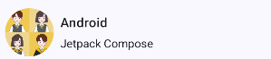
  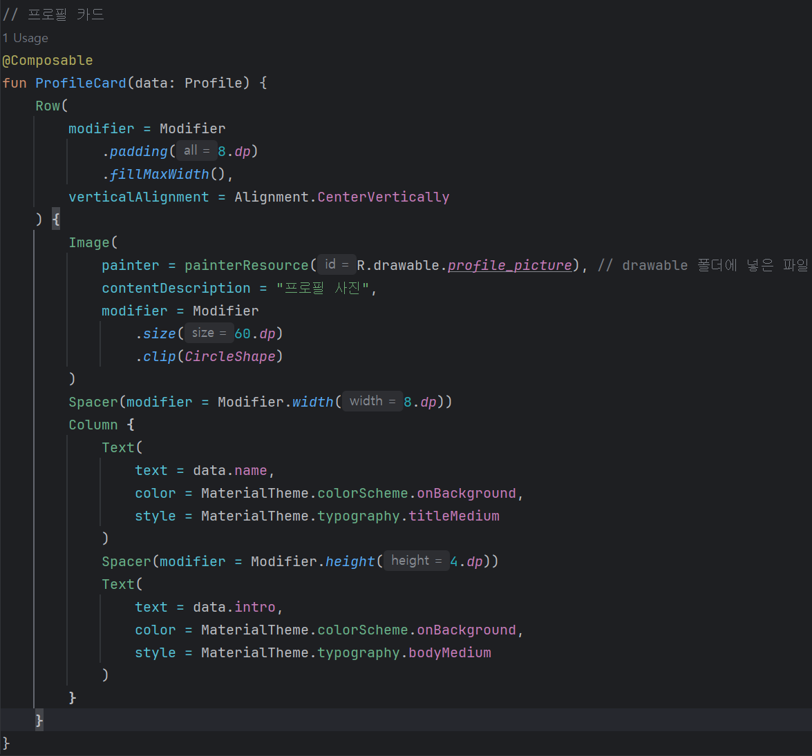
  

**메시지_카드**

  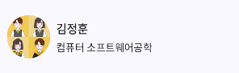
  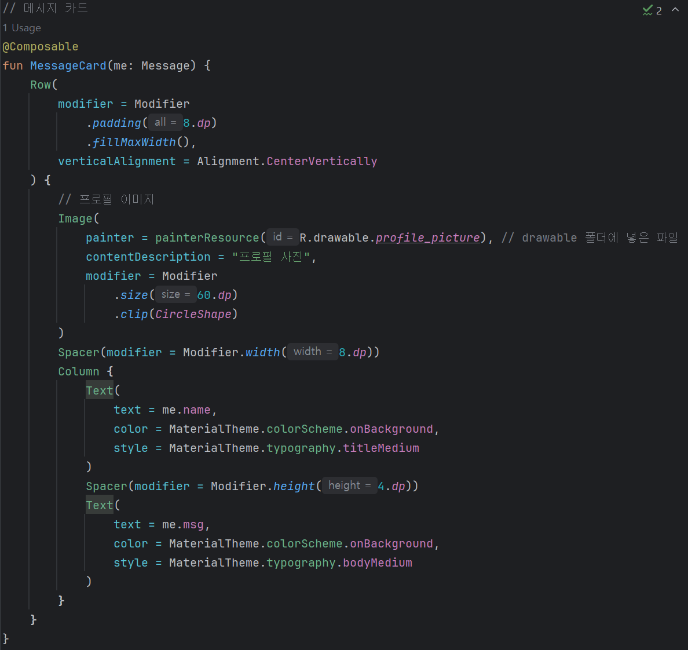
  

**_화이트 모드, 다크 모드_**

  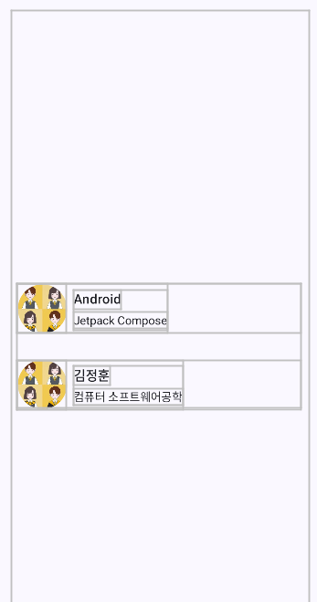
  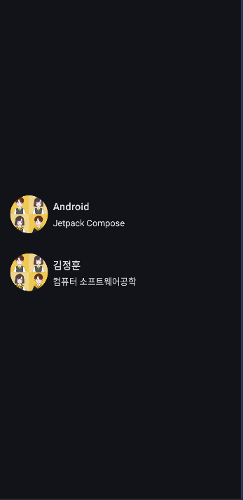
  

## w05 ( 이벤트 처리 )
**클릭**

  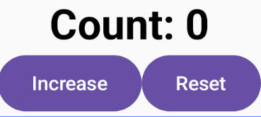
  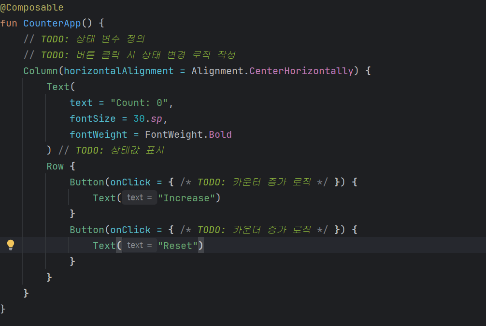
  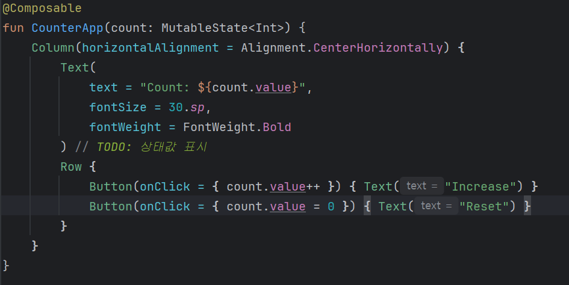

**타이머**

  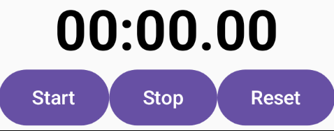
  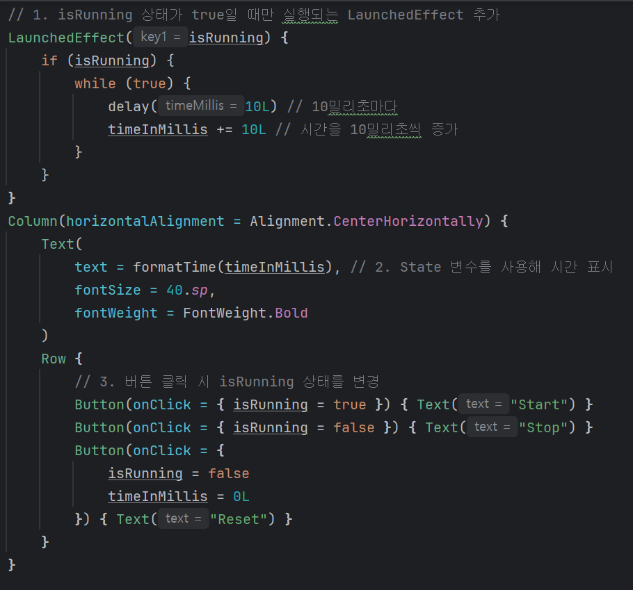
  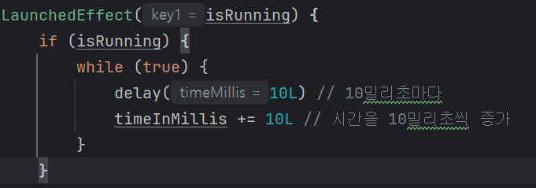

## w06 ( 버블 게임 )
## 게임화면

  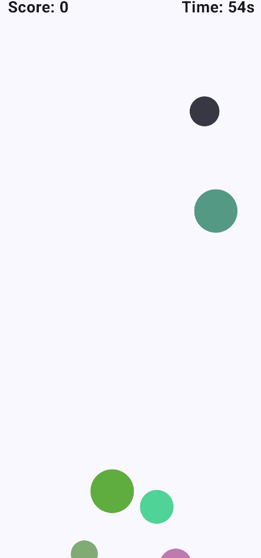

## UI ##

  

## 버블 ##

  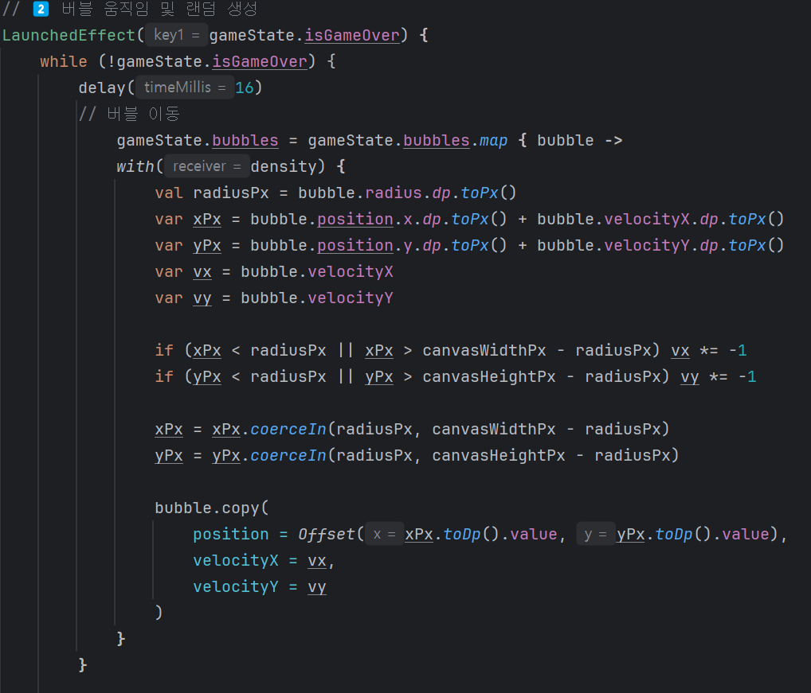
  

## 이벤트 ##

  
  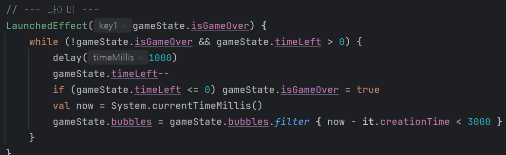

## 스네이크 게임
**게임화면**

  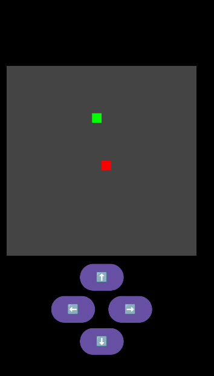
  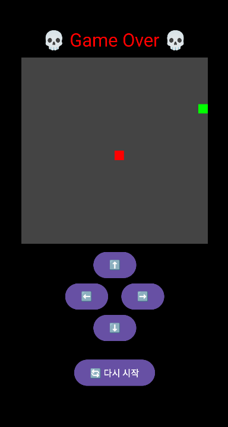

**코드**
####
